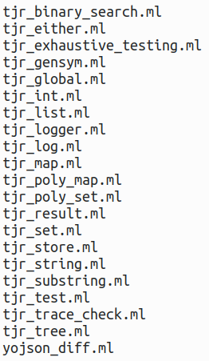
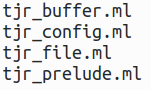

# tjr_lib, a simple OCaml utility library

Very simple modules for debugging, files, lists, strings and substrings, trees etc.

NOTE there are two libraries: `tjr_lib_core` and `tjr_lib`.

## Building and installing (requires OCaml 4.07 for List.to_seq)

To **build from source**, in this directory type: `make`.  NOTE this requires the dependencies to be manually installed first using opam.

To **install from source using opam**, in this directory, type: `opam pin add tjr_lib .` (NOTE the "." is part of the command.)

To **install from github using opam**, type: 

`opam pin add tjr_lib https://github.com/tomjridge/tjr_lib.git`

## Dependencies

Core:

| Dependency                  | Comment                                                      |
| --------------------------- | ------------------------------------------------------------ |
| yojson                      | FIXME should move code which uses this to non-core           |
| ppx_deriving_yojson         | tjr_tree pretty-printing; yojson_diff; FIXME consider moving to non-core |
| ppx_deriving_yojson.runtime | ocamlfind lib installed with ppx_deriving_yojson             |
| XX ppx_sexp_conv            | tjr_tree pretty-printing (currently commented out)           |

Non-core:

| Dependency   | Comment                                                      |
| ------------ | ------------------------------------------------------------ |
| tjr_lib_core |                                                              |
| bos          | read and write files; execute external command FIXME replace? |
| fileutils    | tjr_file, permissions handling                               |
| omd          | markdown processing                                          |
| XX str       | (not needed anymore?) tjr_file (filename sanitization); doesn't need to be installed via opam? |

## Tjr_lib_core

## Tjr_lib

